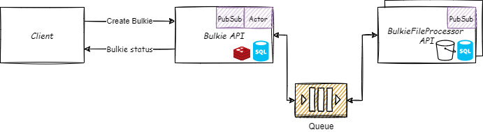
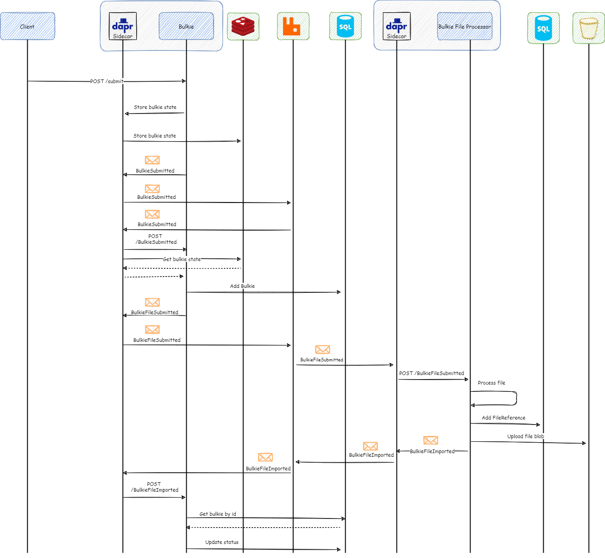

# Bulkie - Reference Application

Dapr event-driven reference application.

## What does it do?
* Imports a batch of files ("Bulkie") into the system.
* Tracks status of imports

## How is it implemented?

Dapr Building blocks: 
* Virtual actors
* Pub/Sub
* Actor state

Event driven:
* Status updates
* File processing submissions

Below shows a sequence diagram for the creation of a Bulkie (with Dapr building blocks included):

## Setup

Add files to the Setup directory in BulkieFileProcessor.API. Note: Solution assumes that large files are  chunked. 